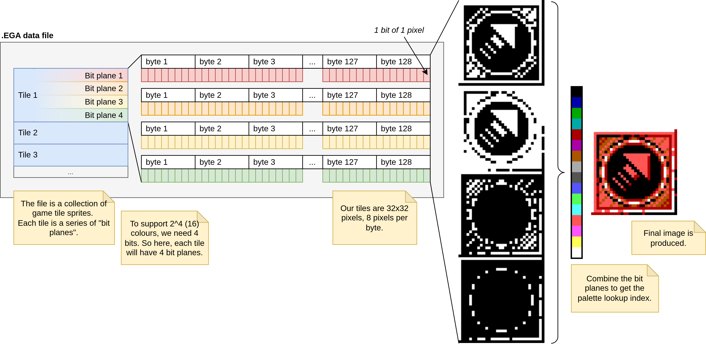

# EGA Data Reader

This program will take raw EGA data from a file and convert it into a PNG file.

It also provides a GUI tool for rapid testing of correct tile size and number of bit planes.

## Background

I was interested in reading some graphics files from an MS-DOS game, Cloud Kingdoms (https://www.mobygames.com/game/16175/cloud-kingdoms/).

These files have names like `PCBLOX1.EGA`, `PCHERO3.EGA` - so not immediately viewable like png, jpg etc.

The extension gives the first clue that these files are related to the Enhanced Graphics Adapter (EGA) display standard.

In short, the files follow the following format:



* The file is a collection of game tile sprites. Each tile is a series of "bit planes".
* To support 2^4 (16) colours, we need 4 bits for the palette lookup. So here, each tile will have 4 bit planes.
* Our tiles are 32x32 pixels, 8 pixels per byte.
* Combine the bit planes to get the palette lookup index.
* Final image is produced.

Some files aren't split into tiles - instead, each bit plane will be the size of the entire image (e.g. 320x200).

### Why are the files like this?

This data is in the exact format required when sent to the EGA. The program just points to the start of the file memory, no need to transform the data.

## Build

Install .NET 7 SDK. Then go to base dir and run:
` > dotnet build EgaFileReader/EgaFileReader.csproj -r linux-x64 --self-contained`

Or for windows:
` > dotnet build`

## Use

Command line:

```
Usage: efr [-u] -i FILEPATH -o OUTPATH -t 32x32 -p 4 -z 10
  [-h] [--help]: Show this page
  [-i] [--input]: Path to EGA data file
  [-o] [--output]: Path to PNG output file
  [-t] [--tilesize]: Tile dimensions, x and y separated by 'x' e.g. 32x32
  [-z] [--outputwidthtiles]: Number of tiles in output image per row
  [-p] [--numbitplanes]: Number of bit planes. 1 for 2-colour, 2 for 4-colour, 4 for 8-colour
  [-u] [--gui]: Run GUI tool
```

### GUI

Run `efr -u` to open the GUI tool. .EGA files will be loaded from current directory (.EGA files only).

Keyboard controls:

* UP/DOWN/LEFT/RIGHT: Change tile size
* `Q`/`E`: Set tile width of output file (how many tiles per row)
* `P`: Set number of bit planes (1, 2 or 4)
* `N`: Go to next file in current directory
* `S`: Save to png (`output.png` in current directory)

## Credits

* App icon - The creators of Cloud Kingdoms (1990): (https://www.mobygames.com/game/16175/cloud-kingdoms/)
* SDL2 C# Bindings - flibitijibibo: (https://github.com/flibitijibibo/SDL2-CS)
* MS-DOS Disassembler - Sourcer: https://reverseengineering.stackexchange.com/a/3076
* m3x6 font by Daniel Linssen (with modifications): https://managore.itch.io/m3x6
* Base `Spl.Core` engine code from Monogame: https://github.com/MonoGame/MonoGame/

## Reference Material

### CGA / EGA
* Color Graphics Adapter on Wikipedia: https://en.wikipedia.org/wiki/Color_Graphics_Adapter
* EGA-VGA: A Programmer's Reference Guide 2nd Edition (1990): https://archive.org/details/EGA-VGA_Programmers_Reference_Guide_2nd_Ed_Bradley_Dyck_Kliewer
  * Specifically, for understanding EGA bit planes
* Color/Graphics Adapter I/O Ports on Tech Help!: http://www.techhelpmanual.com/901-color_graphics_adapter_i_o_ports.html
* Enchanced Graphics Adapter I/O Ports on Tech Help!: http://www.techhelpmanual.com/899-enhanced_graphics_adapter_i_o_ports.html
* Programmer's guide to PC & PS/2 video systems : maximum video performance from the EGA, VGA, HGC, and MCGA (1987): https://archive.org/details/programmersguide0000wilt/

### MS-DOS Assembly
* Advanced MS-DOS Programming 2nd Edition (1988): https://www.pcjs.org/documents/books/mspl13/msdos/advdos/
  * (Which is sourced from Microsoft Programmer’s Library 1.3 CD-ROM)
* Complete 8086 instruction set: https://www.eng.auburn.edu/~sylee/ee2220/8086_instruction_set.html
* x86 Assembly Guide: https://flint.cs.yale.edu/cs421/papers/x86-asm/asm.html

